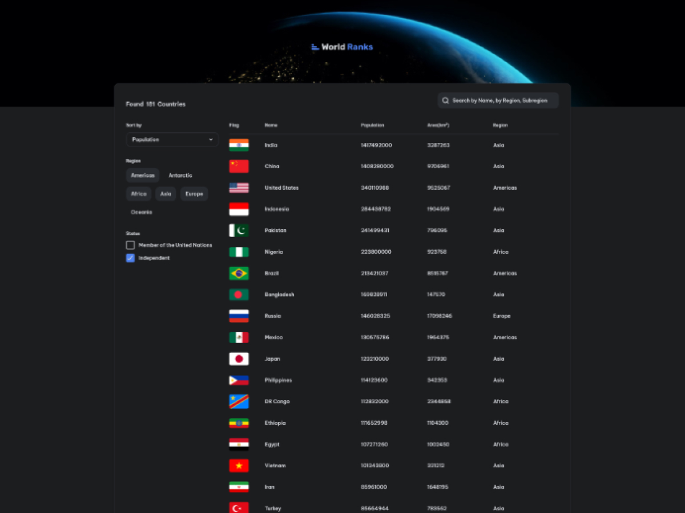

<h1 align="center">WorldRanks | devChallenges</h1>

<div align="center">
   Solution for a challenge <a href="https://devchallenges.io/challenge/country-page" target="_blank">Country Page - WorldRanks
</a> from <a href="http://devchallenges.io" target="_blank">devChallenges.io</a>.
</div>

<div align="center">
  <h3>
    <a href="https://mooenz.github.io/react-countries-page/">
      Demo
    </a>
    <span> | </span>
    <a href="https://devchallenges.io/solution/30359">
      Solution
    </a>
    <span> | </span>
    <a href="https://devchallenges.io/challenge/country-page">
      Challenge
    </a>
  </h3>
</div>

<!-- TABLE OF CONTENTS -->

## Table of Contents

- [Overview](#overview)
  - [What I learned](#what-i-learned)
  - [Useful resources](#useful-resources)
- [Built with](#built-with)
- [Features](#features)
- [How to use](#how-to-use)
- [Acknowledgements](#acknowledgements)
- [Author](#author)

<!-- OVERVIEW -->

## Overview



WorldRanks es una aplicación web que muestra información sobre todos los países del mundo. Permite explorar países, filtrarlos por diferentes criterios y ver información detallada de cada uno, incluyendo sus países vecinos.

### What I learned

Durante el desarrollo de este proyecto, adquirí y reforcé conocimientos importantes:

#### 🐻 Zustand - Manejo de estado global

Aprendí a implementar una store con Zustand para manejar el estado global de la aplicación. Zustand me permitió crear un store simple y eficiente para gestionar los filtros de búsqueda (texto, región, estado) de forma centralizada, evitando el prop drilling y manteniendo el código limpio:

```typescript
// Ejemplo de implementación de store
import { create } from 'zustand';

const useFilterStore = create((set) => ({
	filters: { text: '', region: [], status: [] },
	setFilter: (key, value) =>
		set((state) => ({
			filters: { ...state.filters, [key]: value },
		})),
}));
```

#### ⚛️ React + React Router

Afiancé el uso de React para construir aplicaciones web interactivas. Implementé **React Router** para:

- Manejar las diferentes vistas de la aplicación (listado y detalle de país)
- Utilizar parámetros dinámicos (`/:name`) para obtener y mostrar el contenido específico de cada país
- Configurar rutas con lazy loading para optimizar el rendimiento

#### 🎨 Animaciones con Tailwind

Implementé la librería **tailwind-animations** para agregar transiciones suaves al mostrar:

- La lista de países al cargar la página
- Los resultados filtrados cuando el usuario aplica filtros
- Mejorando la experiencia de usuario con feedback visual

### Useful resources

- [REST Countries API](https://restcountries.com/) - API utilizada para obtener la información de los países.
- [Zustand Documentation](https://zustand-demo.pmnd.rs/) - Documentación de Zustand para el manejo de estado global.

### Built with

- [React](https://react.dev/) v19.2.0
- [TypeScript](https://www.typescriptlang.org/) v5.9.3
- [Vite](https://vitejs.dev/) v7.2.4
- [Tailwind CSS](https://tailwindcss.com/) v4.1.18
- [React Router](https://reactrouter.com/) v7.12.0
- [Zustand](https://zustand-demo.pmnd.rs/) v5.0.10 - State management
- [@vitejs/plugin-react-swc](https://github.com/vitejs/vite-plugin-react-swc) - Fast Refresh con SWC

## Features

- 🌍 **Listado de países**: Visualiza todos los países del mundo con su bandera, nombre, población, área y región.
- 🔍 **Búsqueda por texto**: Filtra países por nombre.
- 📊 **Ordenamiento**: Ordena países por población, nombre, área o región.
- 🗺️ **Filtro por regiones**: Filtra por continentes (Americas, Africa, Asia, Europe, Oceania, Antarctic).
- ✅ **Filtro por estado**: Filtra por países independientes o miembros de la ONU.
- 📄 **Página de detalle**: Información completa de cada país incluyendo:
  - Bandera
  - Nombre oficial y común
  - Población y área
  - Capital
  - Subregión
  - Idiomas
  - Monedas
  - Continente
  - Países vecinos
- ⚡ **Lazy Loading**: Carga diferida de páginas para mejor rendimiento.
- 📱 **Diseño responsivo**: Adaptable a diferentes tamaños de pantalla.

## How to use

Para clonar y ejecutar esta aplicación, necesitas [Git](https://git-scm.com) y [Node.js](https://nodejs.org/en/download/) instalados. Se recomienda usar [pnpm](https://pnpm.io/) como gestor de paquetes.

```bash
# Clonar el repositorio
git clone https://github.com/Mooenz/react-countries-page.git

# Entrar al directorio
cd react-countries-page

# Instalar dependencias
pnpm install

# Ejecutar en modo desarrollo
pnpm dev

# Compilar para producción
pnpm build

# Previsualizar build de producción
pnpm preview
```

## Acknowledgements

- [REST Countries API](https://restcountries.com/) - Proveedor de datos de países.
- [devChallenges.io](https://devchallenges.io/) - Plataforma del challenge.

## Author

- [GitHub - @mooenz](https://github.com/Mooenz)
- [LinkedIn - @mooenz](https://linkedin.com/in/mooenz)
- [Sitio web](https://twitter.com/mooenz)

---
